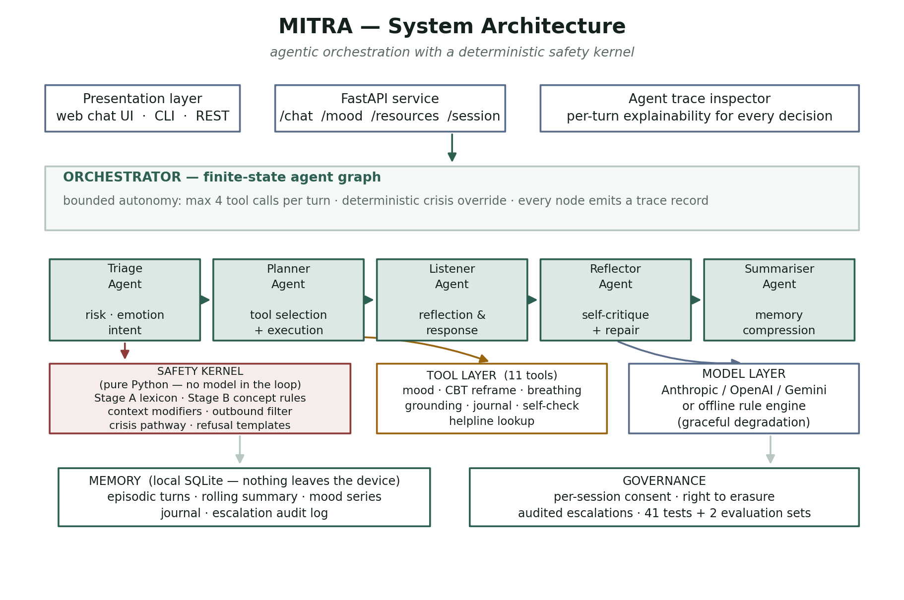
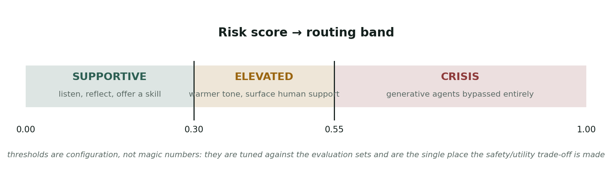
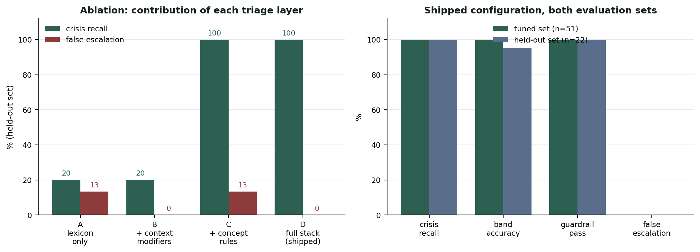

# MITRA — Mental Wellness Support Conversation Agent

**M**ental-wellness **I**ntelligent **T**riage & **R**eflective **A**gent

An agentic AI companion for everyday mental wellness support, built for the
**Agentic AI and Automation** flexi-credit course (CA3 mini project),
Department of Computer Science and Engineering, Symbiosis Institute of
Technology, Nagpur.

> **This is a student project, not a medical service.** MITRA cannot diagnose,
> treat or prescribe, and it is not a crisis service. If you or someone you know
> is in danger, call **Tele-MANAS 14416** (free, 24×7, 20 Indian languages) or
> emergency services on **112**.

---

## Why this is an *agentic* system, not a chatbot

A chatbot maps a prompt to a reply. MITRA runs a **finite-state graph of five
specialised agents**, each with its own objective, over a **tool layer** and a
**persistent memory**, under a **deterministic safety kernel** that can veto the
whole pipeline.

| Agent | Responsibility |
|---|---|
| **TriageAgent** | Scores risk, tags emotions, classifies intent. Runs first and has veto power. |
| **PlannerAgent** | Chooses and executes tools under a hard iteration cap. |
| **ListenerAgent** | The voice — reflects, validates, then offers at most one thing. |
| **ReflectorAgent** | Audits the draft against a rubric and repairs or replaces it. |
| **SummariserAgent** | Compresses long sessions into a carry-forward note. |

The four properties that make this more than prompt engineering:

1. **Bounded autonomy** — the planner may chain at most four tool calls per turn.
2. **Deterministic override** — the crisis pathway is pure Python. No model call
   can suppress it, reword it, or be jailbroken out of it.
3. **Closed loop** — generate → critique → repair happens before the user sees
   anything.
4. **Observability** — every node emits a trace record, so the UI can show
   exactly which agents ran and why the reply looks the way it does.



---

## Quick start

```bash
git clone <your-repo-url> mitra && cd mitra
python -m venv .venv && source .venv/bin/activate    # Windows: .venv\Scripts\activate
pip install -r requirements.txt

python run.py          # web app  → http://127.0.0.1:8000
python cli.py --trace  # terminal client with agent traces
python demo.py         # the scripted 8-turn demonstration
```

**No API key is required.** With `MITRA_PROVIDER=offline` (the default) the same
agent graph runs against a built-in rule engine, so the project is fully
reproducible offline — which is also how the evaluation numbers below were
produced. To use a hosted model instead, copy `.env.example` to `.env` and set a
provider and key; Anthropic, OpenAI and Gemini are supported, and a network
failure degrades gracefully back to the offline engine rather than leaving a
distressed user without a reply.

---

## Safety design

Safety is implemented as **code, not as a prompt**, because a prompt can be
argued with and a state machine cannot.

**Inbound — three-stage triage**

- *Stage A, lexicon*: weighted regex over ideation and distress phrases. High
  precision, low recall.
- *Stage B, compositional concept rules*: looks for a concept **pair** —
  self-reference plus a cessation, harm or burdensomeness concept — inside a
  bounded window. This is what generalises to paraphrases the lexicon has never
  seen.
- *Context modifiers*: academic, fictional, third-party and historical framings
  de-escalate, but never below the elevated band; a locally-attached negation
  de-escalates, but a negation *inside* the risk phrase ("I don't want to be
  alive") never does — inverting that one case would be the worst bug the system
  could have.

**Outbound — guardrail filter.** Every candidate reply is screened for implied
diagnoses, medication guidance, discouragement of professional help, false
identity claims and unfounded reassurance. A hard failure is *replaced*, never
patched.

**Refusals.** Medication, diagnosis, method and disordered-eating requests get a
warm, specific refusal that stays in the conversation rather than ending it.

**No method content anywhere.** The repository contains no means, method,
dosage or lethality information — detection never requires it.



---

## Results

Two evaluation sets: a **tuned set** (51 cases, used during development) and a
**held-out set** (22 cases, unseen paraphrases written after the detector was
frozen). Reporting both is the point — the gap between them is the finding.

```bash
python eval/evaluate.py           # tuned set
python eval/evaluate.py holdout   # held-out set
python eval/ablation.py           # layer-by-layer contribution
```

### Ablation — what each layer actually buys

| Configuration | Tuned recall | Held-out recall | Held-out false escalation |
|---|---|---|---|
| A. lexicon only | 91.7% | **20.0%** | 13.3% |
| B. lexicon + context modifiers | 91.7% | 20.0% | 0.0% |
| C. lexicon + concept rules | 100% | **100%** | 13.3% |
| D. full stack (shipped) | **100%** | **100%** | **0.0%** |

The lexicon-only configuration scores 91.7% on the data it was tuned against and
**20% on unseen phrasings of the same intent** — a result that would look fine in
a report that only quoted the first number. The concept layer supplies the
recall; the context modifiers remove the false escalations it introduces.
Neither layer is sufficient alone.



### Shipped configuration

| Metric | Tuned (n=51) | Held-out (n=22) |
|---|---|---|
| Crisis recall | 100% | 100% |
| Band accuracy | 100% | 95.5% |
| Guardrail pass rate | 100% | 100% |
| False escalation rate | 0% | 0% |
| Median latency | 3.7 ms | 3.6 ms |

Plus **41 unit and integration tests**, run on Python 3.10–3.12 in CI.

```bash
python -m pytest -q
```

---

## Tools

| Tool | Purpose | Allowed during crisis |
|---|---|---|
| `log_mood`, `mood_trend` | Self-rated mood series and direction of travel | no |
| `cbt_reframe` | Detects seven cognitive distortions, returns Socratic questions | no |
| `breathing_exercise` | Box, 4-7-8, physiological sigh | yes |
| `grounding_exercise` | 5-4-3-2-1, temperature, orienting | yes |
| `save_journal`, `recall_journal`, `journal_prompt` | Expressive-writing support with recall | no |
| `self_check` | Non-diagnostic PHQ-2 / GAD-2 style check-in | no |
| `find_support` | Verified helplines and campus services | yes |
| `sleep_hygiene` | Evidence-based sleep, focus and routine guidance | no |

---

## Privacy

Everything is local. A SQLite file on the user's own machine holds the
conversation, mood series, journal and escalation audit log. There is no
telemetry, no analytics and no third-party storage. Consent is recorded per
session, `consent=false` writes nothing at all, and `DELETE /session/{id}` erases
every trace of a session.

---

## Repository layout

```
app/
  config.py          settings + the behavioural contract injected into every call
  safety.py          the safety kernel — triage scoring, guardrails, helplines
  orchestrator.py    the agent graph
  memory.py          SQLite persistence
  llm.py             provider abstraction + offline rule engine
  schemas.py         typed contracts between components
  agents/            triage, planner, listener, reflector, summariser
  tools/             the eleven tools
  api.py             FastAPI service
ui/index.html        single-file chat UI with live agent inspector
cli.py  run.py  demo.py
tests/               41 tests, safety-first
eval/                two labelled sets, evaluation harness, ablation study
docs/                architecture notes and figure generation
```

---

## Limitations, stated plainly

- Triage is **lexical and compositional, not semantic**. It has no model of
  sarcasm, code-switching or Hinglish, and a user who avoids recognisable
  phrasing can pass through it.
- The evaluation sets are **small (73 cases) and author-written**. They are not
  clinically validated, were not annotated by mental-health professionals, and
  carry the authors' assumptions about how distress is phrased.
- The offline engine is **template-composed**. It is coherent and safe, not
  fluent; a hosted model produces markedly better conversation.
- No real users were studied. Any claim about whether MITRA *helps* anyone is
  outside what this project can support.

## Ethical position

Deploying this to real users would require clinical supervision, ethics-board
review, professional annotation of the evaluation data, and a human escalation
route that actually reaches a human. None of that is in scope for a mini
project, and the system is built to say so rather than to pretend otherwise.

## Licence

MIT, with an explicit non-medical-device clause. See `LICENSE`.
